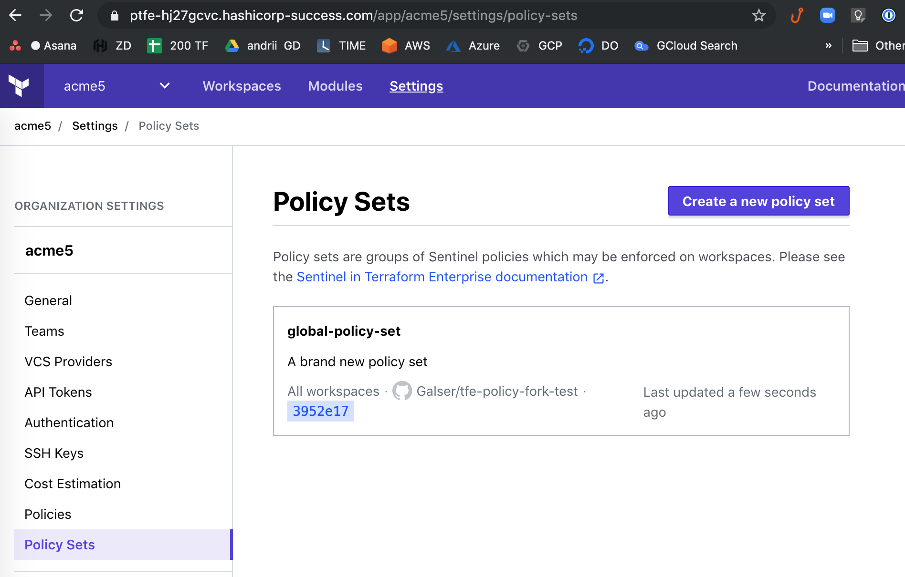
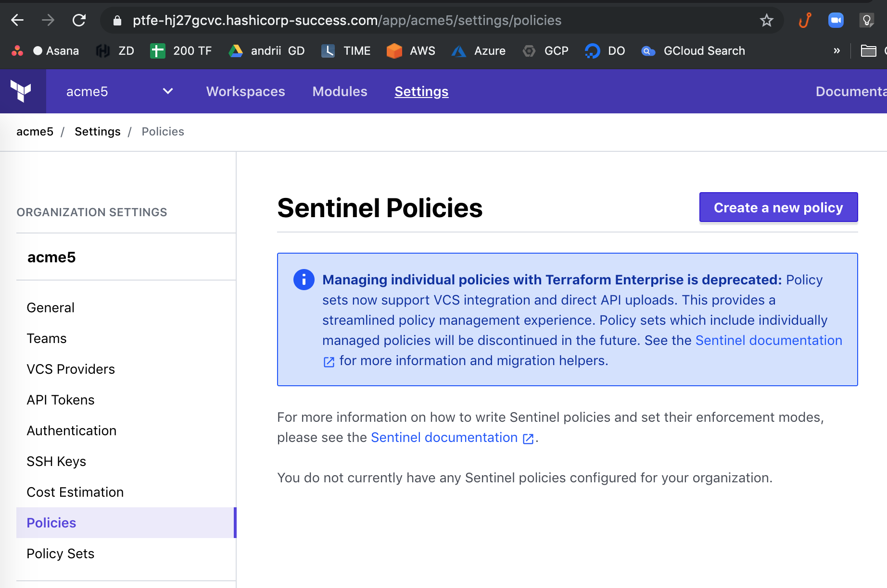

# tfe-policy-set-via-tfe-provider
Setting Policy Set in TFE via TFE Provide

Example of how to set up `sentinel policy set` in Terrafrom Enterprise via [tfe provider]( https://www.terraform.io/docs/providers/tfe/index.html)

# Instructions (for Terraform CLI 0.12 ) : 

- Create auth token in the VCS of your choice, I am using GitHub : https://github.com/settings/tokens
- Export it as environment variable :
  ```export TF_VAR_github_oauth_token=YOUR_TOKEN```
- Create [variables.tf](variables.tf) with the content :
  ```terraform
  variable "tfe_hostname" {
    default = "FQDN of your TFE instance here"
  }

  variable "tfe_org" {
    type = string
    description = "tfe organization"
    default = "acme5"
  }
  
  variable "github_oauth_token" {
    type = string
  }
  
  variable "github_repo" {
    type = string
    default = "Galser/tfe-policy-fork-test" # <<-- your Sentinel policy set repo
  }
  
  ```
- Create following [main.tf](main.tf) : 
  ```terraform
  provider "tfe" {
    hostname = "${var.tfe_hostname}"
  }

  resource "tfe_oauth_client" "test" {
    organization     = "${var.tfe_org}" # TFE organization
    api_url          = "https://api.github.com"
    http_url         = "https://github.com"
    oauth_token      = "${var.github_oauth_token}"
    service_provider = "github"
  }

  resource "tfe_policy_set" "test" {
    name         = "global-policy-set"
    description  = "A brand new policy set"
    global       = true
    organization = "${var.tfe_org}" # TFE organization

    vcs_repo {
      identifier         = "${var.github_repo}"
      branch             = "master"
      ingress_submodules = false
      oauth_token_id     = "${tfe_oauth_client.test.oauth_token_id}"
    }
  }
  ```
- Execute `terraform init` 
- Apply code `terraform apply`
  Example of main prt of the output :
  ```bash
  ...
  Terraform will perform the following actions:

    # tfe_policy_set.test will be created
    + resource "tfe_policy_set" "test" {
        + description  = "A brand new policy set"
        + global       = true
        + id           = (known after apply)
        + name         = "global-policy-set"
        + organization = "acme5"

        + vcs_repo {
  provider "tfe" {
            + branch             = "master"
  # tfe-policy-set-via-tfe-provider
            + identifier         = "Galser/tfe-policy-fork-test"
            + ingress_submodules = false
  # tfe-policy-set-via-tfe-provider
  variable "tfe_hostname" {
            + oauth_token_id     = "ot-WF2Xrqrsdfsdfsd3242134324"
          }

      }
  ...
  ```
 
- Enjoy! Now you should have Policy Set named **"global-policy-set"** in your TFE as per screenshot below : 



And no individually managed polices at all : 




Thank you.


# TODO 
- [ ] convert to module
